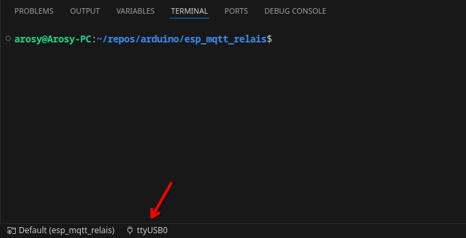
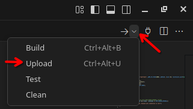

# Description

This project allows the remote control of a relais attached to an esp32 or esp8266.

## Features

- Works for both esp32 and esp8266.

- Toggleable relais through mqtt messages.

- Automatically reconnect to wifi when connection is lost.

- Automatically reconnect to mqtt broker when connection is lost.

## Configuration

The file `include/config.h` contains all customizeable options. You need to change atleast the wifi ssid, mqtt broker credentials and the gpio pin used by the relay.

## Build the esp firmware

1.) Open the project directory within visual studio code.

2.) Ensure that you have the [PlatformIO](https://platformio.org/install/ide?install=vscode) extension installed for [Visual Studio Code](https://code.visualstudio.com/).

3.) Choose an appropiate serial device: 

4.) Choose **Upload**:

